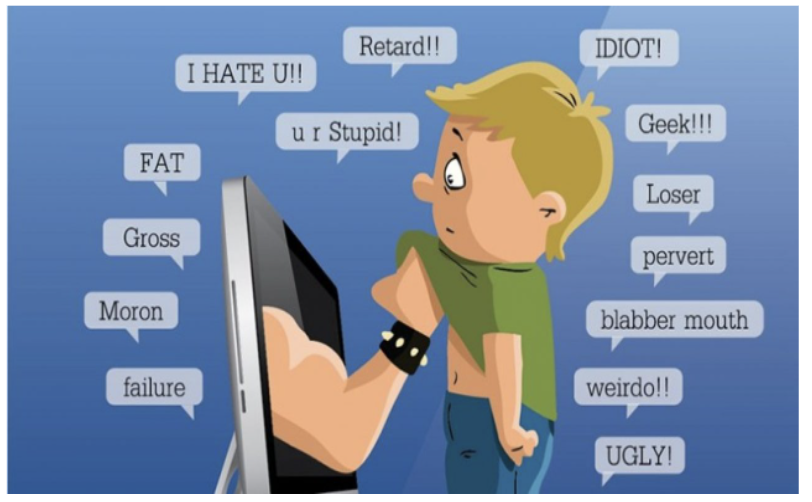
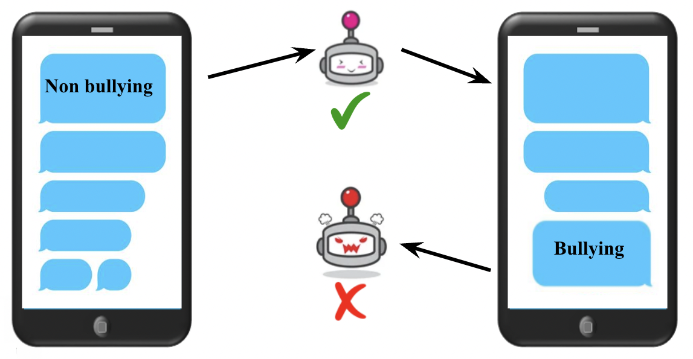
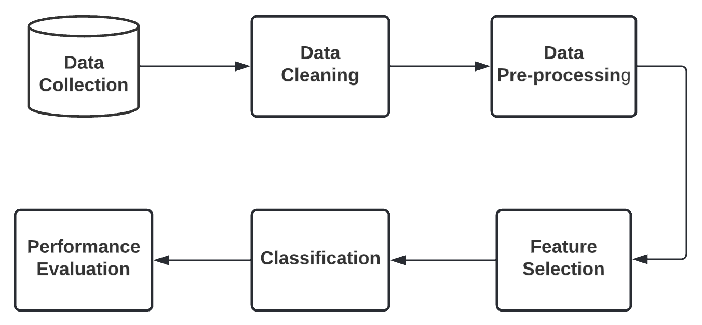
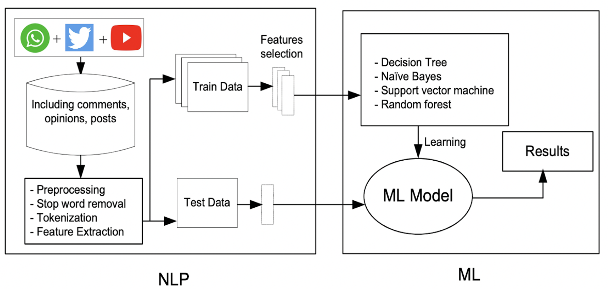
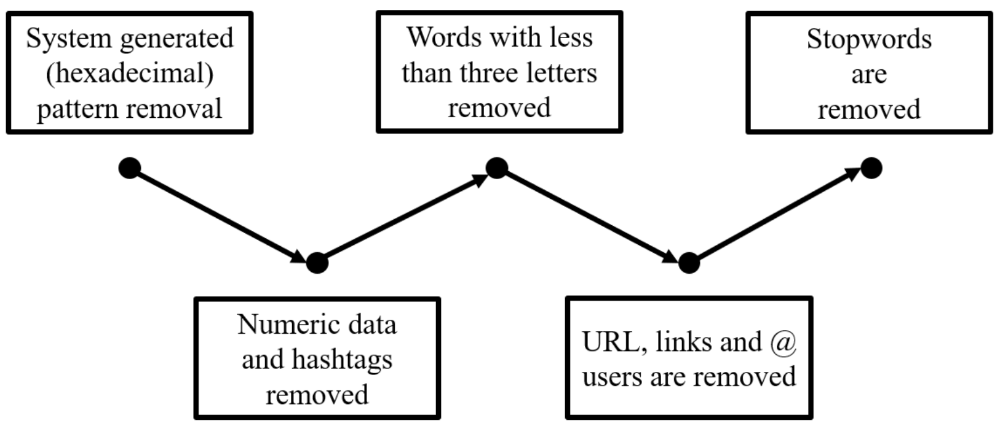
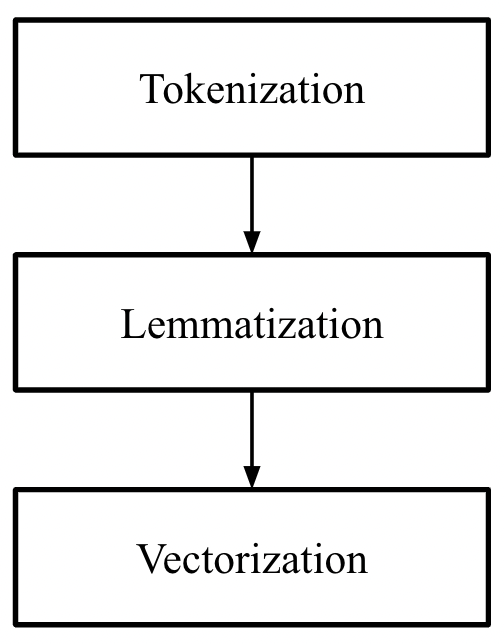
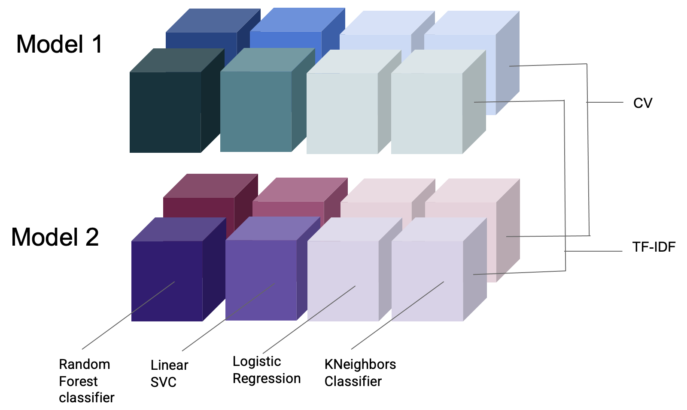
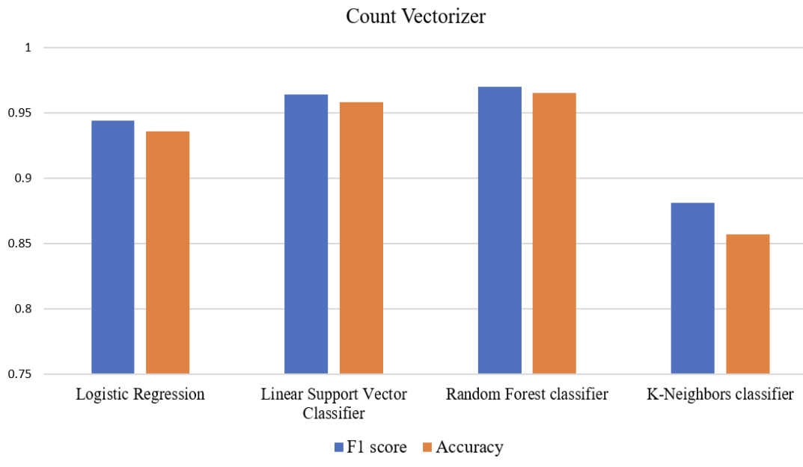
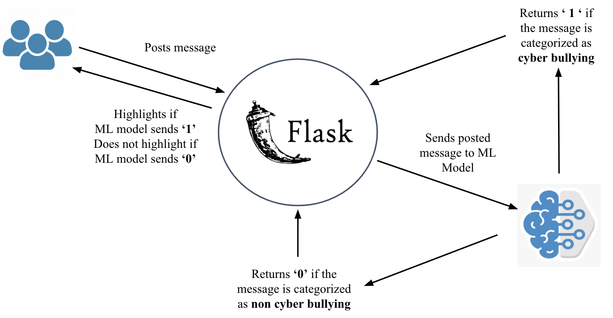

# CyberBullying-Detection-in-Hinglish-Languages-Using-Machine-Learning-

## Table of Content

 1. Aim
 2. Learning-Objective
 3. problem statement
 4. Technologies-used
 5. Design flow
 6. block diagram
 7. Technical-aspects
 8. Result and Discussion
 9. Design and Architecture of Chat Prediction Service
 10. User Interface design
 11. installation

### Aim :- 

Our proposed idea contributes to solving the problem by identifying and classifying text or messages of an intimidating or threatening nature. Our aim was to build a model to classify or identify cyberbullying in English and Hinglish languages and to build a Chat application which can predict whether the text entered in group chats is bullying or non-bullying. 

### Learning Objective :- 

The following points were the objective of the project . If you are looking for all the following points in this repo then i have not covered all in this repo. I'm working on blog about this mini project and I'll update the link of blog about all the points in details later .(The main intention was to create an end-to-end group chat application which can predict whether the text entered in groups is bullying or non-bullying.)  
The main Objective of the project are:
- Extracting real time data from social media sites.
- Selecting best feature extraction model in text classification between Count Vectorization(CV) and Term Frequency-Inverse Frequency in document(TF-IDF)
- Building various Machine Learning Model using Training dataset.
- Selecting best model by comparing accuracy, precision, f1 score and recall.
- perform predictions on testing data and analyze the results.
- Building and Deployment group chat-application.

### problem statement ?

- As an issue that poses an increased threat to the younger generation, cyberbullying requires critical monitoring on various social media platforms. The existing solutions are incapable to keep up with the escalation of online bullying. Text matching technique has been widely used in these solutions which does not provide accurate results.
- Thus we want to develop a model that can detect offensive or hateful words in English and Hinglish language. We want our model to be highly accurate    and fast. This model can help detect Cyberbullying on various social media networking websites.

### Technologies Used :- 

 

[

]

### Design Flow :- 

 
###  Block Diagram :- 

The above diagram describes cyberbullying detection framework used, it has two major parts Natural Language Processing and Machine Learning.
#### 1. Natural Language Processing:
In this phase, we have collected real time tweets from Twitter, extracted Whatsapp chats and Youtube comments in English and Hinglish language. This real time data contains various unnecessary characters, so before applying the machine learning algorithms, data cleaning is to be performed to prepare the data for the detection phase.
In the pre-processing stage we remove hashtags, stopwords, numeric data, hexadecimal patterns and convert the text into lower case.It is done by using numpy with the help of vectorize functions. We manually created a list of stopwords for English and Hinglish language and applied it to remove these words from the clean data because the presence of these unnecessary words adversely a↵ects the accuracy and predictions of the model. We then applied NLP techniques like Tokenization to break raw text into words called as tokens, Lemmatization to remove a given word to its root word and vectorization for converting raw text into vectors or a number.
After pre-processing we splitted the data into training and testing data. Next, we applied two important features selection of text, which are:
- Count Vectorizer
- Term frequency- Inverse frequency.

#### 2. Machine Learning:
In this second phase, we applied various machine learning approaches like Linear SVC, Decisison Tree, Naive Bayes, Bagging classifier, Logistic Regression, Random Forest, MultinomailNB, K Neighbours Clas- sifier and Adaboost classifier to train the model and find the accuracy for each model based on the literature survey we conducted. We also calculated F1 score for evaluation purposes and improved accu- racy by repeating the stages again. We wanted to select best pair between feature selection like TF-IDF and count vectorizer and machine learning model. For this we have done a comparative analysis between count vectorizer and TF-IDF, from this comparative analysis we found out the best pair which has higher accuracy and less prediction time and made its pickle file. After that we passed the testing data to the models to compare the accuracy of various algorithms with each other. After following these stages, our model is able to predict whether the text enter is toxic i.e bullying and harmful for the society or non - toxic i.e non-bullying in Hinglish language.

### Technical aspects

#### Data Cleaning

The data is required to clean before passing through multiple ML models. as shown in Fig:4.4, this steps are necessary to removed from the data because they do not contribute for classification phase.

#### Pre-processing Techniques 

After cleaning the data we have applied Natural language processing techniques because the machine learning algorithm cannot work directly with the raw text that is they cannot understand the whole sentences given to it, so we transform these sentences into understandable format by using pre-processing techniques.

#### Feature Selection

This technique helps to measure the quality of the resulting vector representations. This works with similar words that tend to close with words that can have multiple degrees of similarity. Vectorization is performed prior to sending the training and testing data set through the ML models.

### Result and Discussion

#### Comparative Analysis between two Feature Selections methods

We are doing a comparative analysis between two feature extraction techniques like count vectorization CV and term frequency inverse frequency in document TF-IDF with few algorithms like Logistic Regression, Random Forest Classifier, Linear SVC, and KNeighbors Classifiers as shown in figure below.

#### Comparison of Algorithms with count vectorizer

#### Comparison of Algorithms with Term Frequency Inverse Document Frequency

#### Findings 

TF-IDF gives slightly better accuracy then CV because it not only aims on the frequency of tokens present in the corpus, but also provides the importance on the tokens. We can remove the tokens that are less important for analysis, hence it makes the our training model e�cient and less complex by reducing the our dimensions of input.

#### Classification and Building models for Hinglish Language

### Design and Architecture of Chat Prediction Service

We have made a service wrapper using flask for our prediction model. Now whenever the group of users write or post the messages in format of text, it will request our service wrapper and our service wrapper will load the Machine learning model which is in pickle file. this ML model will predict whether the given message is bullying or non-bullying i.e either 1 or 0 and will return to the service wrapper. Later our service wrapper will respond to the users, whether the message enter is bullying or non-bullying.

### User Interface Design

We have created a Multi Group chat application using python sockets and Tkinder GUI. It has the functionalities to create room or join room using room Id and send messages within a room.

#### Non-Bullying Flow
 
Whenever the user posts a message in the chat, our prediction service will the load the model and if the text enter is categorized as non-bullying then text or messages will be displayed on the chat screen as shown in the video below.

#### Bullying Flow

Whenever the user posts a message in the chat, our prediction service will load the model and if the text enter is categorized as bullying, then the message will be not displayed on the chat screen, the sender will get the warning as Stop bullying people and behave decently and the receiver will not receive the bullying message. Instead, they will be informed that a bullying message has been detected it and it is hidden as shown in the video below.

### Installation :- 

- Clone this repository and unzip it.
- Begin a new virtual environment with Python 3 and activate it.
- Install the required packages using pip install -r requirements.txt
- Execute the command: python app.py.

###  Made with &nbsp;❤️ by  [Karan Shah](https://karanshah1910.tech/) , [keval rajapara](https://www.linkedin.com/in/jil-patel-4936a11b2) , [Chaitaniya phadhtare](https://www.linkedin.com/in/akshat-shah-225171203)

